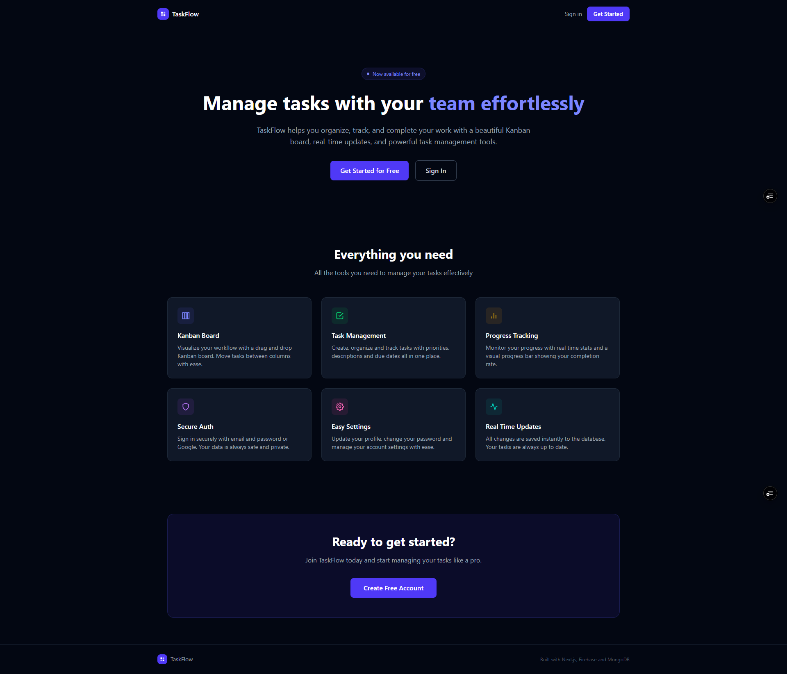
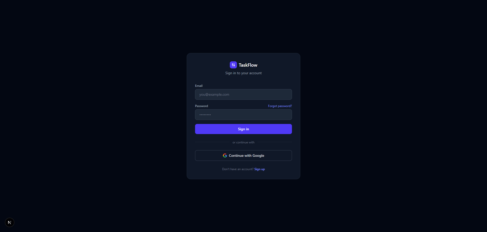
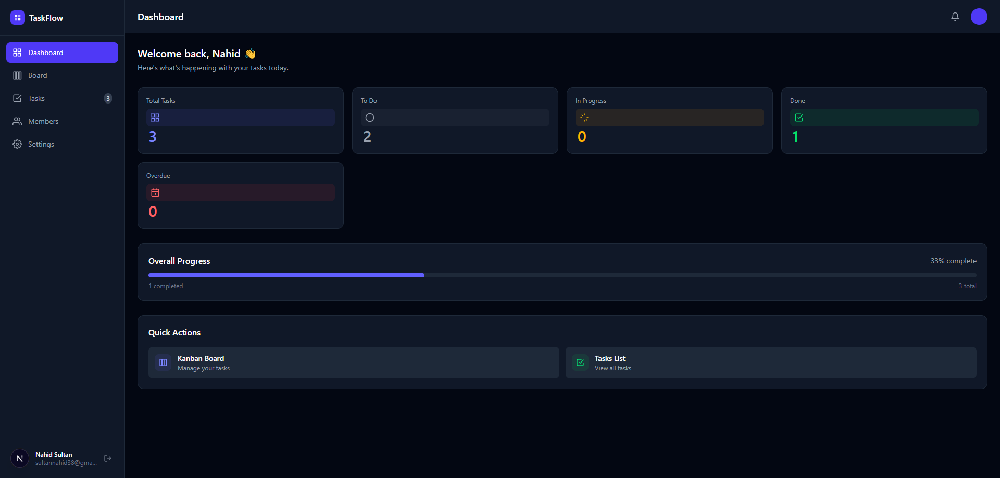
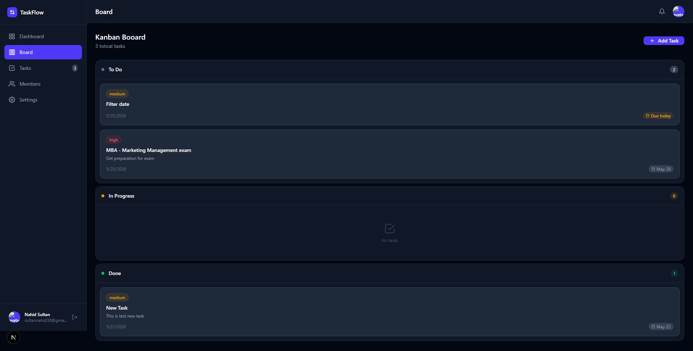
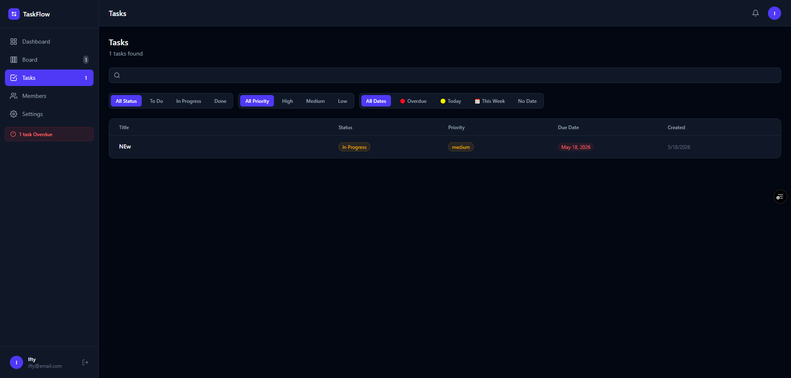
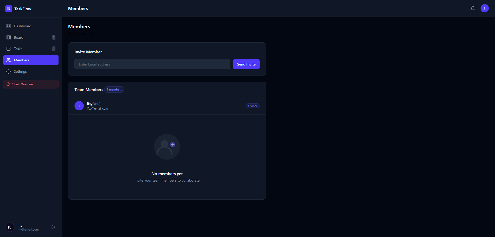
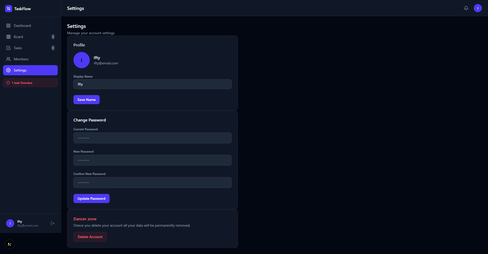

# TaskFlow

A full-stack SaaS productivity app built with Next.js, Firebase, and MongoDB. TaskFlow helps you manage tasks with a beautiful Kanban board, real-time updates, and team collaboration features.

## 🚀 Live Demo

[https://task-flow-nextjs-application.vercel.app/](https://task-flow-nextjs-application.vercel.app)

> **Demo credentials**
> Email: `demo@taskflow.com`
> Password: `demo123456`

---

## 📸 Screenshots

### Landing Page


### Login


### Dashboard


### Kanban Board


### Tasks List


### Members


### Settings


---

## ✨ Features

- **Authentication** — Email/password and Google sign-in via Firebase
- **Kanban Board** — Drag and drop tasks between Todo, In Progress, and Done columns
- **Task Management** — Create, edit, delete tasks with priority levels and due dates
- **Tasks List** — Table view with filter by status, priority and due date
- **Real-time Search** — Search tasks by title or description instantly
- **Dashboard** — Real-time stats and progress tracking
- **Team Members** — Invite members by email, auto-activate on signup
- **Settings** — Update profile, change password, delete account
- **Loading Skeletons** — Professional skeleton loaders while data loads
- **Toast Notifications** — Beautiful notifications for every action
- **Confirmation Dialogs** — SweetAlert2 confirmation before deleting
- **Responsive** — Works on mobile, tablet, and desktop
- **Dark Mode** — Beautiful dark UI throughout

---

## 🛠️ Tech Stack

| Technology | Purpose |
|---|---|
| [Next.js 16](https://nextjs.org/) | Full-stack React framework |
| [React](https://reactjs.org/) | UI library |
| [Tailwind CSS](https://tailwindcss.com/) | Styling |
| [Firebase Auth](https://firebase.google.com/) | Authentication |
| [MongoDB Atlas](https://www.mongodb.com/atlas) | Database |
| [Mongoose](https://mongoosejs.com/) | MongoDB ODM |
| [@dnd-kit](https://dndkit.com/) | Drag and drop |
| [SweetAlert2](https://sweetalert2.github.io/) | Confirmation dialogs |
| [React Hot Toast](https://react-hot-toast.com/) | Toast notifications |
| [Vercel](https://vercel.com/) | Deployment |

---

## 📁 Project Structure

```
taskflow/
├── app/
│   ├── (auth)/
│   │   ├── login/
│   │   └── signup/
│   ├── (dashboard)/
│   │   ├── dashboard/
│   │   ├── board/
│   │   ├── tasks/
│   │   ├── members/
│   │   └── settings/
│   ├── api/
│   │   ├── tasks/
│   │   ├── tasks/[id]/
│   │   ├── tasks/stats/
│   │   └── workspaces/
│   ├── components/
│   │   ├── auth/
│   │   ├── board/
│   │   ├── dashboard/
│   │   ├── layout/
│   │   ├── members/
│   │   ├── settings/
│   │   ├── tasks/
│   │   └── ui/
│   ├── context/
│   │   └── index.js
│   ├── hooks/
│   │   ├── useAuth.js
│   │   ├── useTasks.js
│   │   ├── useTaskList.js
│   │   ├── useTaskActions.js
│   │   ├── useStats.js
│   │   └── useWorkspace.js
│   └── providers/
│       ├── AuthProvider.js
│       ├── StatsProvider.js
│       └── TasksProvider.js
├── lib/
│   ├── mongodb.js
│   └── firebase.js
├── models/
│   ├── Task.js
│   └── Workspace.js
└── utils/
    └── dueDate.js
    └── getInitials.js
    
```

---

## 🚦 Getting Started

### Prerequisites

- Node.js 18+
- MongoDB Atlas account
- Firebase project

### Installation

**1. Clone the repository**

```bash
git clone https://github.com/nahidsultan19/TaskFlow-nextjs-application.git
cd TaskFlow-nextjs-application
```

**2. Install dependencies**

```bash
npm install
```

**3. Set up environment variables**

Copy `.env.example` to `.env.local`:

```bash
cp .env.example .env.local
```

Fill in your values:

```env
MONGODB_URI=your_mongodb_connection_string

NEXT_PUBLIC_FIREBASE_API_KEY=your_api_key
NEXT_PUBLIC_FIREBASE_AUTH_DOMAIN=your_project.firebaseapp.com
NEXT_PUBLIC_FIREBASE_PROJECT_ID=your_project_id
NEXT_PUBLIC_FIREBASE_STORAGE_BUCKET=your_bucket
NEXT_PUBLIC_FIREBASE_MESSAGING_SENDER_ID=your_sender_id
NEXT_PUBLIC_FIREBASE_APP_ID=your_app_id
```

**4. Run the development server**

```bash
npm run dev
```

Open [http://localhost:3000](http://localhost:3000) in your browser.

---

## 🔑 Environment Variables

| Variable | Description |
|---|---|
| `MONGODB_URI` | MongoDB Atlas connection string |
| `NEXT_PUBLIC_FIREBASE_API_KEY` | Firebase API key |
| `NEXT_PUBLIC_FIREBASE_AUTH_DOMAIN` | Firebase auth domain |
| `NEXT_PUBLIC_FIREBASE_PROJECT_ID` | Firebase project ID |
| `NEXT_PUBLIC_FIREBASE_STORAGE_BUCKET` | Firebase storage bucket |
| `NEXT_PUBLIC_FIREBASE_MESSAGING_SENDER_ID` | Firebase messaging sender ID |
| `NEXT_PUBLIC_FIREBASE_APP_ID` | Firebase app ID |

---

## 🏗️ Architecture

### Authentication Flow
```
User signs in (Firebase)
    → onAuthStateChanged fires
    → User stored in AuthContext
    → AuthGuard protects dashboard routes
    → Pending workspace invites activated automatically
```

### Shared State Architecture
```
TasksContext (single source of truth)
    ├── KanbanBoard → useTasks → reads shared tasks
    ├── TaskList → useTaskList → reads same shared tasks
    └── Any update → all components update instantly
```

### API Routes
```
GET    /api/tasks              → fetch all tasks by userId
POST   /api/tasks              → create new task
PATCH  /api/tasks/[id]         → update task
DELETE /api/tasks/[id]         → delete task
GET    /api/tasks/stats        → get task counts by status
GET    /api/workspaces         → get user workspace
POST   /api/workspaces         → create workspace
POST   /api/workspaces/invite  → invite member by email
POST   /api/workspaces/remove  → remove member
POST   /api/workspaces/activate → activate pending member
```

### Database Models

**Task**
```js
{
  title: String,
  description: String,
  status: 'todo' | 'inprogress' | 'done',
  priority: 'low' | 'medium' | 'high',
  dueDate: Date,
  userId: String,
  timestamps: true
}
```

**Workspace**
```js
{
  name: String,
  ownerId: String,
  members: [{
    userId: String,
    email: String,
    name: String,
    role: 'owner' | 'member',
    status: 'active' | 'pending'
  }],
  timestamps: true
}
```

---

## 🚀 Deployment

This app is deployed on Vercel. To deploy your own:

1. Push your code to GitHub
2. Import the project on [Vercel](https://vercel.com)
3. Add all environment variables
4. Deploy!

Also make sure to:
- Add your Vercel domain to Firebase **Authorized Domains**
- Add `0.0.0.0/0` to MongoDB Atlas **Network Access**

---

## 👨‍💻 Author

**Nahid Sultan**

- GitHub: [@nahidsultan19](https://github.com/nahidsultan19)
- LinkedIn: [https://www.linkedin.com/in/nahid-sultan01/](https://linkedin.com)

---

## 📄 License

This project is open source and available under the [MIT License](LICENSE).

---

## 🙏 Acknowledgements

- [Next.js](https://nextjs.org/) for the amazing framework
- [Firebase](https://firebase.google.com/) for authentication
- [MongoDB Atlas](https://www.mongodb.com/atlas) for the database
- [Vercel](https://vercel.com/) for hosting
- [@dnd-kit](https://dndkit.com/) for drag and drop
